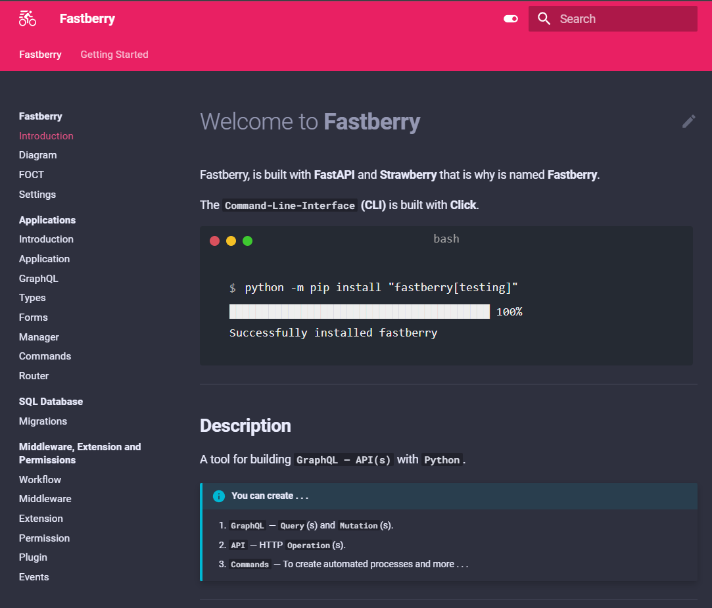

<h1 style="font-size: 5em; letter-spacing: -2px; font-family: Georgia, sans-serif;" align="center">
	Welcome to <strong>Fastberry</strong>
</h1>

	
	
	

	<strong>GraphQL</strong> — Made Easy

	Links 
	 
	<a href="https://pypi.org/project/fastberry" target="_blank">
	PyPi
	</a>
	 
	<a href="https://github.com/hlop3z/fastberry" target="_blank">
	Github
	</a>
	 
	<a href="https://hlop3z.github.io/fastberry/" target="_blank">
	Docs
	
	</a>

