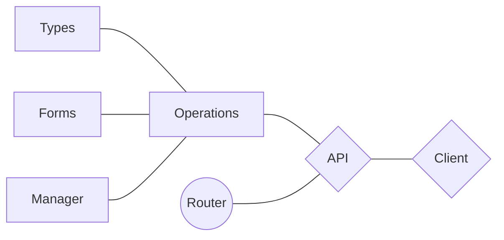

# Introduction

> The **definition** for **"Application"** in **`Fastberry`** is basically a python **`module`**.

The **idea** is to have "self-contained" **`blocks of code`** that are **reusable**.

Also, easy to **share** and use **inside** other **`Fastberry`** projects.

---

## Command

```sh
./manage.py start-app my_awesome_app
```

---

## Files **Layout (Complex)**

!!! abstract "Files (Complex)"

    The example below represents a **Complex Application** that uses **all** of the internal tools

    1. **`commands`** path to create **Internal** commands
    2. **`extension`** path to create **GraphQL**'s extensions
    3. **`permissions`** path to create **GraphQL**'s permissions
    4. **`middleware`** path to create **API**'s middleware
    5. **`on_event`** (optional) path to create middleware for server **Events**'s

    **Name & Usage** of **`on_event`** are **optional**. You can name the `file` anyway you want.

```text
root/
|
|--  apps/
|    `--  MY_APPLICATION/       --> <Directory> - Your App in HERE!
|        |-- __init__.py
|        |-- commands.py
|        |-- extension.py
|        |-- graphql.py
|        |-- middleware.py
|        |-- forms.py
|        |-- permissions.py
|        |-- on_event.py        --> <Optional>
|        |-- router.py
|        `-- types.py
|
`-- etc...
```

## Files **Layout (Simple)**

!!! abstract "Files (Simple)"

    The example below represents a **Simple Application** that uses **only** the necessary tools to build an **API**

    1. **`types`** use to create the equivalent of a database **Model**
    2. **`forms`** use to create complex **input** forms
    3. **`manager`** use to create complex database **Queries & Mutations**
    4. **`graphql`** use to create **operations** of the GraphQL
    5. **`router`** (**optional**) used to create endpoints for **FastAPI**

```text
root/
|
|--  apps/
|    `--  MY_APPLICATION/       --> <Directory> - Your App in HERE!
|        |-- __init__.py
|        |-- forms.py
|        |-- graphql.py
|        |-- manager.py
|        |-- router.py          --> <Optional>
|        `-- types.py
|
`-- etc...
```

---

## Application **Diagram**



!!! info "Demo"

    The example above shows the flow of the API but it also shows all the **`tools`** you can use to build your projects.
