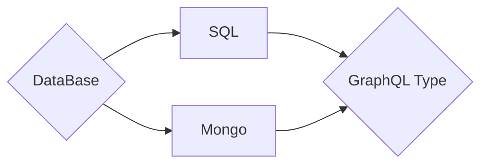
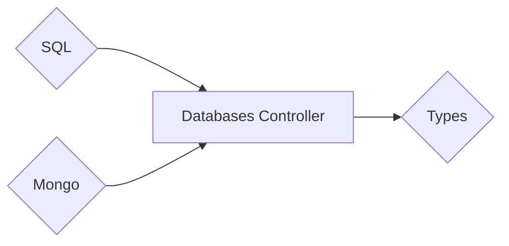

Your **`GraphQL-Types`** **need** to be in a **file** named **`types.py`** inside your **Application**.



## File **Layout**

=== ":material-file: Types (Models)"

    ``` text
    root/
    |--  apps/
    |    `--  MY_APP/
    |         `-- types.py          --> <File> - Your code in HERE!
    `-- etc...
    ```

=== ":material-wrench: Settings"

    ``` text
    root/
    |--  config/                    --> <Directory> - Configurations.
    |    `-- settings.py            --> <File> - API (Pythonic) | Settings.
    `-- etc...
    ```

> Both **`Mongo`** and **`SQLAlchemy`** are **optional**. But I do recommend using **at least one**. Otherwise, there is **no point** in using this section and **instead** you should just declare your **`Types`** by using <a href="https://strawberry.rocks/docs/types/object-types/" target="_blank" rel="noopener noreferrer">**Strawberry**</a>

!!! abstract "Tools"

    You'll mainly use **3 tools** to create the **`types`**.

    1. **`fb.sql.model`**
    2. **`fb.mongo.model`**
    2. **`fb.field`**

## Python **Code**



=== "Types"

    ```python title="types.py"
    # -*- coding: utf-8 -*-
    """
        { Types } for GraphQL
    """

    from typing import Optional
    import fastberry as fb

    import datetime

    # DateTime Functions
    class Date:
        datetime = lambda: datetime.datetime.now()
        date = lambda: datetime.date.today()
        time = lambda: datetime.datetime.now().time()


    # Create your <types> here.
    @fb.sql.model(description="(Type) Read The Docs")
    class Product:
        # Other { Type | Model }
        category: Optional["Category"] = None

        # Core { Python }
        name: str | None = None
        aliases: list[str] | None = None
        stock: int | None = None
        is_available: bool | None = None

        # Custom Scalars { GraphQL }
        created_on: fb.datetime = fb.field(Date.datetime)
        available_from: fb.date = fb.field(Date.date)
        same_day_shipping_before: fb.time = fb.field(Date.time)
        price: fb.decimal | None = None
        notes: list[fb.text] = fb.field(list)
        is_object: fb.json = fb.field(dict)

        # Other { Type | Model }
        async def group(self) -> Optional["Group"]:
            """Group Type"""
            return Group(name="awesome")


    @fb.sql.model
    class Category:
        """(Type) Read The Docs"""

        name: str


    @fb.mongo.model
    class Group:
        """(Type) Read The Docs"""

        name: str
    ```

=== "Databases (settings.py)"

    ```python title="config/settings.py"
    # -*- coding: utf-8 -*-
    """
        { Settings }
    """
    import pathlib

    # Base Directory
    BASE_DIR = pathlib.Path(__file__).parents[1]

    # Installed Apps
    INSTALLED_APPS = []

    # Database(s)
    DATABASES = {
        "sql"  : {"default": "sqlite:///example.db"},
        "mongo": {"default": "mongodb://localhost:27017/example"},
    }
    ```

## Model **Fields**

> **Fields** translate from a particular type between **`Python`** , **`SQL`** and **`GraphQL`** data.

| GraphQL        | Fastberry(Python)       | SQLAlchemy         | JavaScript |
| -------------- | ----------------------- | ------------------ | ---------- |
| **`ID`**       | **`fastberry.ID`**      | Integer            | String     |
| **`String`**   | **`str`**               | String(length=255) | String     |
| **`String`**   | **`fastberry.text`**    | Text               | String     |
| **`Datetime`** | **`datetime.datetime`** | DateTime           | String     |
| **`Date`**     | **`datetime.date`**     | Date               | String     |
| **`Time`**     | **`datetime.time`**     | Time               | String     |
| **`Decimal`**  | **`decimal.decimal`**   | String(length=255) | String     |
| **`Integer`**  | **`int`**               | Integer            | Number     |
| **`Float`**    | **`float`**             | Float              | Number     |
| **`Boolean`**  | **`bool`**              | Boolean            | Boolean    |
| **`JSON`**     | **`fastberry.json`**    | JSON               | Object     |

## Your **instance** includes **two** fields

1. **`_id` :** **(str)** Meant to be the **original** **`Database`** unique identifier.
2. **`id` :** **(str)** Meant to be the **client's** **`GraphQL`** unique identifier.
