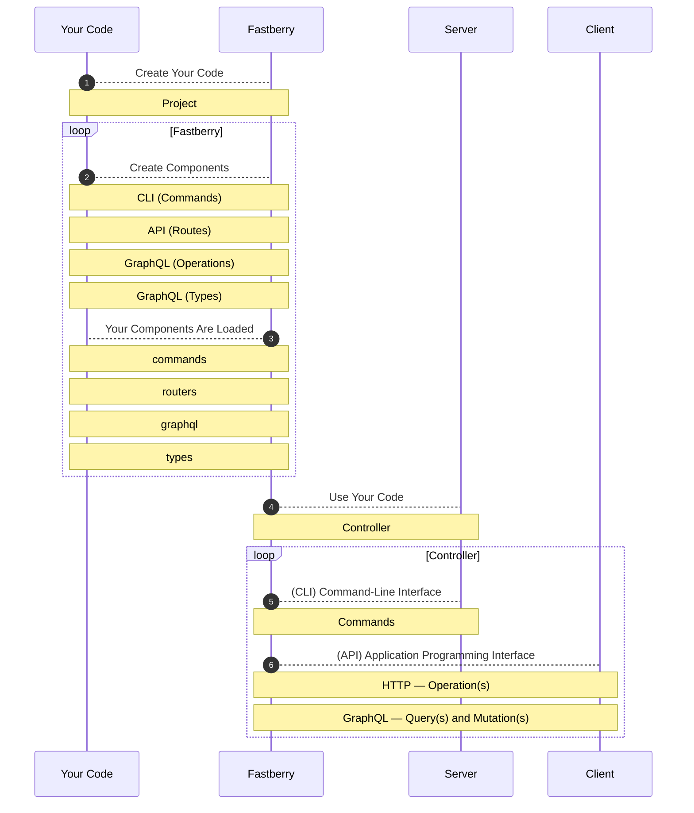

# Project **Sequence Diagram**

> **Below** is a graphic **description** for the project's **workflow**.

## App **Controller**

```python
from fastberry import App

Controller = App()
```

!!! example "Controller"

    ```python
    # Commands (1)
    Controller.cli
    # Router (2)
    Controller.router
    # GraphQL (3)
    Controller.graphql
    # Types (4)
    Controller.types
    ```

    1. **Commands** —  Built with **Click** Commands.
    2. **Routes** — Built with **FastAPI**.
    3. **GraphQL** — **`Query`**(s) and **`Mutation`**(s) Built with **Strawberry**.
    4. **Types** — **`GraphQL` Strawberry** Types.

!!! info "Project's Structure"

    ```text
    root/
    |
    |--  apps/
    |    |
    |    `--  MY_APPLICATION/       --> <Directory> - Your App in HERE!
    |        |
    |        |-- __init__.py
    |        |-- commands.py
    |        |-- graphql.py
    |        |-- router.py
    |        `-- types.py
    |
    `-- etc...
    ```

## App **Plugins**

!!! abstract "Files"

    All Your **files** get **loaded** to these **namespaces**

    1. **`./commands.py`** gets loaded to **`cli`**
    2. **`./router.py`** gets loaded to **`router`**
    3. **`./graphql.py`** gets loaded to **`graphql`**
    4. **`./types.py`** gets loaded to **`types`**


