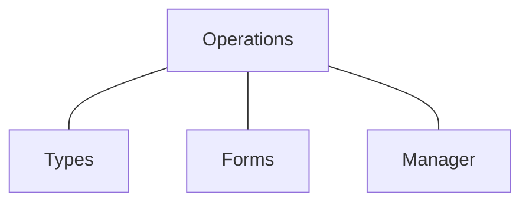

# **F.O.C.T**

!!! abstract "F.O.C.T Inspired by M.V.C"

    **F.O.C.T** is Inspired by **M.V.C** (Model, View, Controller).

    - **`Form`** = Client's input for the **Operation**.
    - **`Operation`** = GraphQL Operation (**Mutation** or **Query**)
    - **`Controller`** = Handles updates to the database **table** aka: **`Type`**
    - **`Type`** = Database **Model** aka: **`Table`**

## Acronym **" F.O.C.T "**

1. **(F)**orm — Client **Inputs**
2. **(O)**peration (GraphQL) — API **Methods**
3. **(C)**ontroller (Manager) — Database **Methods**
4. **(T)**ype (Aka: Model) — Table **Schema**



| Name       | API Reference                                            |
| ---------- | -------------------------------------------------------- |
| Form       | **`fastberry.input`** AND **`fastberry.value`**          |
| Operation  | **`fastberry.gql`**                                      |
| Controller | **`fastberry.manager`**                                  |
| Type       | **`fastberry.sql.model`** OR **`fastberry.mongo.model`** |

## F.O.C.T **Demo**

=== "Type"

    ``` python title="types.py"
    """
        { Types } GraphQL
            OR
        { Tables } Database
    """
    import fastberry as fb

    # Mongo Database
    # fb.mongo.model
    @fb.sql.model
    class Category:
        """(Type) Read The Docs"""

        name: str
    ```

=== "Controller (Manager)"

    ``` python title="manager.py"
    """
        { Controller } for the Database(s)
    """
    import fastberry as fb

    from . import types


    class Base:
        @classmethod
        async def all(cls):
            return await cls.objects.all()

        @classmethod
        async def reset(cls):
            return await cls.objects.delete(None, all=True)


    @fb.manager
    class Category(Base):
        model = types.Category

        @classmethod
        async def create(cls, form):
            data = form.data
            results = await cls.objects.create(data.__dict__)
            return results
    ```

=== "Form"

    ``` python title="forms.py"
    """
        { Forms } for Operations
    """
    import fastberry as fb

    # Import Once's per project in any App.
    # IF you want the built-in (Forms) to be register in the GraphQL API.
    from fastberry import item, pagination

    form = fb.input("form")

    @form
    class Category:
        """(Form) Read The Docs"""

        name = fb.value(
            str,
            required=True,
        )

    @form(name="SearchEngine")
    class Search:
        """(Form) Read The Docs"""

        name = fb.value(
            str,  # Single Typing
            default=None,
        )
        count = fb.value(
            int,
            default=None,
        )
        cash = fb.value(
            float,
            default=None,
        )
        amount = fb.value(
            fb.decimal,
            default=None,
        )
        start_date = fb.value(
            fb.date,
            default=None,
        )
        end_datetime = fb.value(
            fb.datetime,
            default=None,
        )
        timestamp = fb.value(
            fb.time,
            default=None,
            required=False,
        )

    ```

=== "Operations (GraphQL)"

    ``` python title="graphql.py"
    """
        { Operations } for GraphQL
    """
    import fastberry as fb

    from . import forms, manager, types

    @fb.gql
    class Demo:
        """GraphQL Manager"""

        class Meta:
            """Class Meta-Data"""

            app = False
            model = "Category"

        class Query:
            """GraphQL Query"""
            async def detail(item: fb.item # (1)
            ) -> fb.query(types.Category): # (2)
                """(Detail-Operation) Read The Docs"""

                return types.Category(_id=1, id="$encoded_id$", name="Cool")

            async def search(
                search: forms.Search,
                pagination: fb.pagination # (3)
            ) -> fb.edges(types.Category): # (4)
                """(Search-Operation) Read The Docs"""

                # Do Something if input { IS VALID } ...
                if search.input.is_valid:
                    print("\n# Client's Inputs #")
                    print(search.input.data)
                    print(pagination.input.data)

                # Get Data from the { Database } ...
                results = await manager.Category.all()
                print("\n# Database Response #")
                print(results)

                # Return { Page }
                return fb.page( # (5)
                    edges=[
                        types.Category(_id=1, id=1, name="Computer"),
                        types.Category(_id=2, id=2, name="Radio"),
                    ],
                    length=2,
                    pages=1,
                )

        class Mutation:
            """GraphQL Mutation"""

            async def create(form: forms.Category
            ) -> fb.mutation(types.Category): # (6)
                """(Create-Operation) Read The Docs"""

                # Client's Input
                if form.input.is_valid:
                    print(form.input.data)

                # Errors
                errors_messages = []

                # IF error . . .
                errors_messages.append(
                    fb.error(type="input", text="Error for Demo!") # (7)
                )
                return fb.errors(messages=errors_messages) # (8)
    ```

    1. Use **`item`** to **`annotate`** that you expect a **`ID`** or a list of **`[IDs]`**
    2. Use **`query`** to **`annotate`** that you will **`return`** a specific **`type`**
    3. Use **`pagination`** to **`annotate`** that you expect a **page configuration** (Used to **limit** the **rows** per request)
    4. Use **`edges`** to **`annotate`** that you will **`return`** a **page-list** of **only** a specific **`type`**
    5. Use **`page`** to return a list of **edges**
    6. Use **`mutation`** to return either a **`type`** or a list of **`errors`**
    7. Use **`error`** to create a single **`error-message`**
    8. Use **`errors`** to return a list of **`error`**(s).


    !!! abstract "Tools"

        1. **`fastberry.item`** to **`annotate`** that you expect a **`ID`** or a list of **`[IDs]`**
        2. **`fastberry.query`** to **`annotate`** that you will **`return`** a specific **`type`**
        3. **`fastberry.pagination`** to **`annotate`** that you expect a **page configuration** (Used to **limit** the **rows** per request)
        4. **`fastberry.edges`** to **`annotate`** that you will **`return`** a **page-list** of **only** a specific **`type`**
        5. **`fastberry.page`** to return a list of **edges**
        6. **`fastberry.mutation`** to return either a **`type`** or a list of **`errors`**
        7. **`fastberry.error`** to create a single **`error-message`**
        8. **`fastberry.errors`** to return a list of **`error`**(s).

## Inputs **Tools**

> For **Client-Inpunt** in GraphQL **Query** and **Mutation** Operations.

| Method           | Connects With ... | Description                                                    |
| ---------------- | ----------------- | -------------------------------------------------------------- |
| **`pagination`** | **`[edges]`**     | Use **pagination** for **`annotations`** of client's **input** |
| **`item`**       | **`types`**       | Use **item** for **`annotations`** of client's **input**       |

## Types **Tools**

> For **Annotation** in GraphQL **Query** and **Mutation** Operations.

| Method         | Connects With ... | Description                                            |
| -------------- | ----------------- | ------------------------------------------------------ |
| **`editor`**   | **`types`**       | Use **editor** for a custom-mutation **`annotations`** |
| **`mutation`** | **`types`**       | Use **mutation** for **`annotations`**                 |
| **`query`**    | **`types`**       | Use **query** for **`annotations`**                    |
| **`edges`**    | **`page`**        | Use **edges** for **`annotations`**                    |

## Return **Tools**

> To **Return** Data Via **Query** and **Mutation** Operations.

| Method        | Connects With ... | Description                                                        |
| ------------- | ----------------- | ------------------------------------------------------------------ |
| **`errors`**  | **`[error]`**     | Use **errors** to **`return`** a **list** of **error**(s)          |
| **`page`**    | **`[edges]`**     | Use **page** to **`return`** a **list** of **`edges`**             |
| **`deleted`** | **`types`**       | Use **deleted** to **`return`** a **count** of **`deleted`** items |
