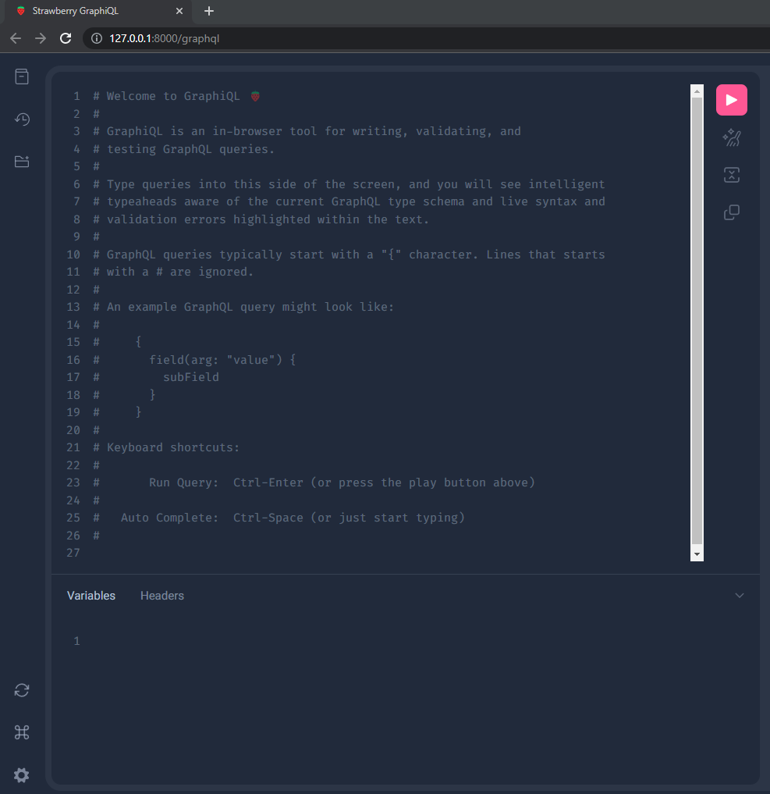
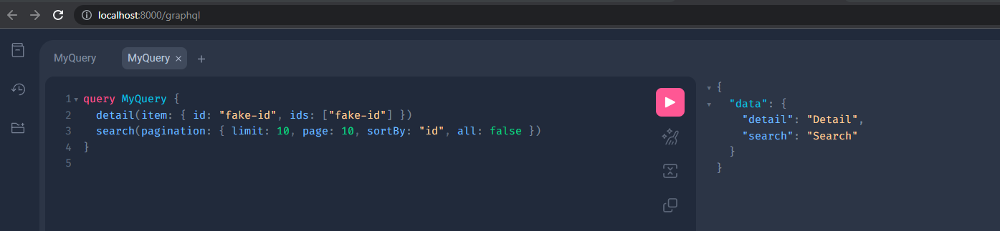

# First **App**

```sh
pdm app start-app demo
```

<div id="terminal-getting-started-first-app" data-termynal></div>

## Settings `config/settings.py` (**Demo**)

!!! note "Installed Apps"

    After creating your first **`demo`** app. **Add** it in the applications list "**`INSTALLED_APPS`**"

```python title="config/settings.py"
# -*- coding: utf-8 -*-
import pathlib

# Base Directory
BASE_DIR = pathlib.Path(__file__).parents[1]

# Installed Apps
INSTALLED_APPS = ["demo"] # (1)
```

1. **INSTALLED_APPS** - Right now we control the **`INSTALLED_APPS`** from here. **However**, depending on **`mode`** in the **`spoc.toml`** is where you place them.

!!! note "Run"

    Start the Server (Again). After adding your **App** to **`INSTALLED_APPS`**.

    ```sh
    pdm app run
    ```

    Then go to <a href="http://127.0.0.1:8000/graphql" target="_blank">**http://127.0.0.1:8000/graphql**</a>

!!! tip "GraphQL"

    IF its working it should look something like the **image below**.



## Testing

!!! info

    Copy the **code below** and **paste it** the browser's editor.

```gql
query MyQuery {
  detail(item: { id: "fake-id", ids: ["fake-id"] })
  search(pagination: { limit: 10, page: 10, sortBy: "id", all: false })
}
```



## Response

!!! info

    After running the query. The editor should **return** the **`json`** below

```json
{
  "data": {
    "detail": "Detail",
    "search": "Search"
  }
}
```

## [Applications](../../applications/)

!!! warning

    **End of this tutorial**. To learn how to create **`Types`** and other **`functionalities`**.

    Please read the full documentation for the [Applications](../../applications/) section.
