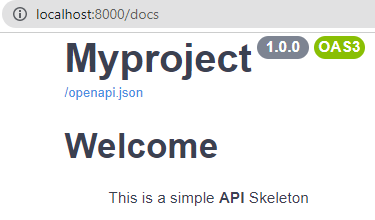

# First **Project**

```sh
pdm run startproject
```

<div id="terminal-getting-started-first-project" data-termynal></div>

## Settings `pyproject.toml` (**Demo**)

```toml
[project]
name = "" # (1)
version = "" # (2)
# etc ...
```

1. **Required** - The Project Must Have a **NAME**.
2. **Required** - The Project Must Have a **VERSION** Ex: **`(0.1.0)`**.

!!! warning

    Make sure that the project's **settings** look something like the **example below. . .** or it **will not work**

```toml title="pyproject.toml"
[project]
name = "myproject"
version = "1.0.0"
# etc ...
```

## Adding a **PDM Command**

```toml title="pyproject.toml"
[project]
name = "myproject"
version = "1.0.0"
# etc ...

[tool.pdm.scripts]
app = "python manage.py" # (1)
```

1. **Command** - Manage Application.

## Finally! **Getting Started**

```sh
pdm app run
```

<div id="terminal-getting-started-first-project-app" data-termynal></div>

!!! note "Wait"

    After the server starts, **then** go to <a href="http://localhost:8000/docs" target="_blank">**http://localhost:8000/docs**</a>

    You can **notice**:

    1. Your project's **name**
    2. Your project's **version**


