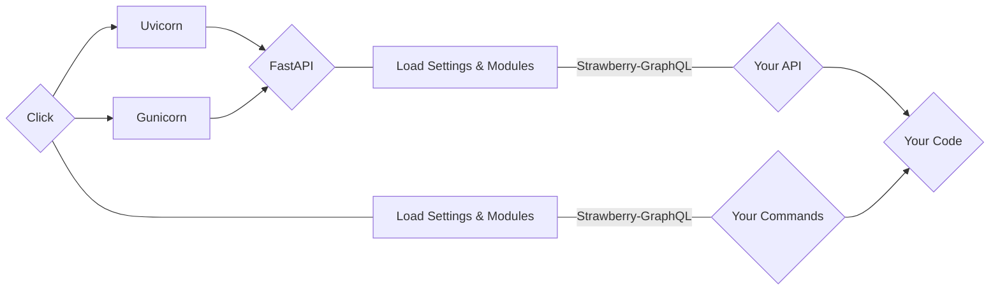

# Welcome to **Fastberry**

Fastberry, is built with **FastAPI** and **Strawberry** that is why is named **Fastberry**.

The **`manager`** is built with **Click**.

### **Built** With:

| Module                                                                                  | Is Used To...                                                         |
| --------------------------------------------------------------------------------------- | --------------------------------------------------------------------- |
| <a href="https://github.com/pallets/click/" target="_blank">**Click**</a>               | **Manage** the server, development process and custom **`Commands`**. |
| <a href="https://fastapi.tiangolo.com/" target="_blank">**FastAPI**</a>                 | **Core** Web **`Framework`**                                          |
| <a href="https://strawberry.rocks/" target="_blank">**Strawberry**</a>                  | **GraphQL** **`Library`**                                             |
| <a href="https://pypi.org/project/PyYAML/" target="_blank">**PyYAML**</a>               | **Load** the project **`Settings`**.                                  |
| <a href="https://pypi.org/project/python-dotenv/" target="_blank">**Python-Dotenv**</a> | **Load** the **`Environment Variables`**.                             |
| <a href="https://pydantic-docs.helpmanual.io/" target="_blank">**Pydantic**</a>         | **Format** `Environment Variables` and more **FastAPI** uses.         |
| <a href="https://www.uvicorn.org/" target="_blank">**Uvicorn**</a>                      | **Run** the server in **`Development`** mode.                         |
| <a href="https://gunicorn.org/" target="_blank">**Gunicorn**</a>                        | **Run** the server in **`Staging`** and **`Production`** mode.        |

---

## **Install** Fastberry

```sh
python -m pip install fastberry
```

## **Install** Uvicorn + Gunicorn

```sh
python -m pip install "uvicorn[standard]" gunicorn
```

---

## **Module** Workflow

> You can create **`commands`** or **`fastapi`** and **`strawberry-graphql`** endpoints.



---

## **Core** Layout

```text
root/                           --> <Directory> - Project's Root.
|
|--  apps/                      --> <Directory> - Modules (aka: Apps) in HERE.
|
|--  config/                    --> <Directory> - Configurations.
|    |-- __init__.py            --> <File> - Load Settings.
|    |-- docs.md                --> <File> - API's Documentation in HERE.
|    |
|    |-- env/                   --> <Directory> - Environments.
|    |   |-- development.env    --> <File> - Development Settings.
|    |   |-- production.env     --> <File> - Production Settings.
|    |   `-- staging.env        --> <File> - Staging Settings.
|    |
|    `-- mode.json              --> <File> - Current Mode.
|
|-- main.py                     --> <File> - FastAPI main.py file.
|-- manage.py                   --> <File> - Run (CLI) Command-Line-Interface.
|-- settings.yaml               --> <File> - Base Settings.
`-- etc...
```

---

## Inspired By **Django**

There are several things from Django that inspire this tool.

Some of the commands and the installation of **modules** (aka: **INSTALLED_APPS**) inside a Django project.

### **Fastberry** comes with a few key **commands**:

- **`startproject`** Create a new **Fastberry** project.
- **`./manage.py run`** Run **FastApi Server**.
- **`./manage.py schema`** Build **GraphQL (Schema + Operations + ReturnTypes)**.
- **`./manage.py start-app`** Create a **Fastberry App** inside your "**`apps`**" directory.
- **`./manage.py --help`** For **more information**.

## **Mode** (Options)

> **`./manage.py run`** Start **FastApi Server**

- `development`

- `staging`

- `production`

> **`./manage.py run --help`** For **more information**.
