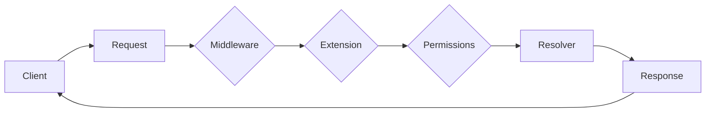
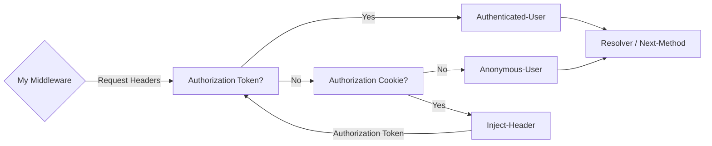
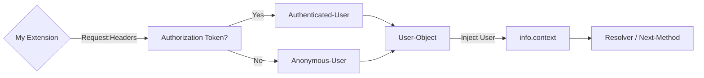
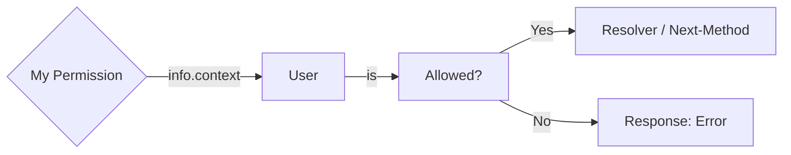

# Middleware + Extension + Permissions

Building a plugin with all **3 elements** (Middleware, Extension and Permissions).

> You can also **combine** them with a **`Router`**. For example: to create a **`User / Authentication`** API.

---

## Plugin **Workflow**

---

## **Middleware** (FastAPI / Starlette)

> User is **`Authenticated`** or **`Anonymous`**?
>
> Inject the **`Authorization Token`** to the **`Headers`** if the is in the **`Cookies`**.

---

## **Extension** (Strawberry)

> Convert **`Authorization-Token`** or **`None`** to a **`User-Object`** and inject it to **`GraphQL`**'s context.

---

## **Permissions** (Strawberry)

> Get the request's **`User`** and check the **`Role`** for a **list of allowed methods**.
>
> Then, check if **`info.field_name`** (which is the name of the current: **`Query`** or **`Mutation`**) is in the **list of allowed methods**.
>
> Alternatively, you can use **`info.python_name`** if you prefer to use the python's original name of the function.

