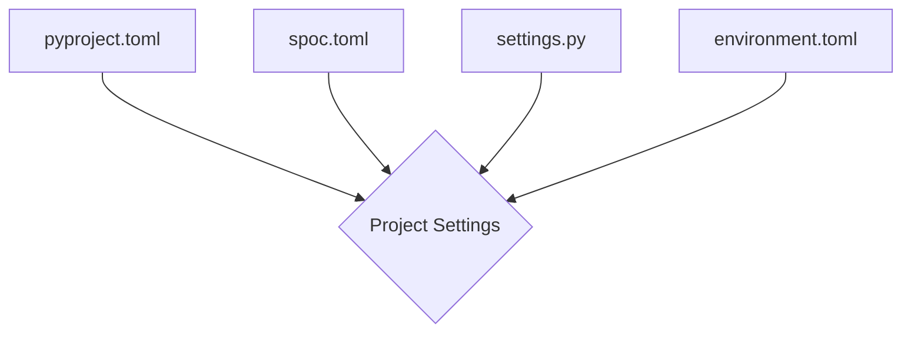

Core **Settings** are in **`TOML`** format. Because **TOML** is easy to read for humans and computers.

!!! example "TOML"

    Since <a href="https://toml.io/en/" target="_blank">**`TOML`**</a>  is **`Python`**'s new best friend. Feels like a good fit for the core **settings** of the project.

---

## Settings **Workflow**

!!! info "Settings"

    1. Load **`pyproject.toml`**
    2. Load **`spoc.toml`**
    3. Load **`settings.py`**
    4. Load **`Environment Variables`**



---

## Settings **Locations**

```text
root/                           --> <Directory> - Project's Root.
|
|--  config/                    --> <Directory> - Configurations.
|    |
|    |-- .env/                  --> <Directory> - Environments.
|    |   |-- development.toml   --> <File> - Development Settings.
|    |   |-- production.toml    --> <File> - Production Settings.
|    |   `-- staging.toml       --> <File> - Staging Settings.
|    |
|    |-- settings.py            --> <File> - Pythonic Settings.
|    `-- spoc.toml              --> <File> - Spoc Settings.
|
|-- pyproject.toml              --> <File> - PyProject Settings.
`-- etc...
```

=== "PyProject"

    ## **pyproject** (TOML)

    ``` toml title="pyproject.toml"
    [project]
    name = "fastberry" # (1)
    version = "0.1.4" # (2)
    description = "GraphQL Made Easy." # (3)

    # etc ... (4)
    ```

    1. **Name** — The **name** of the project.
    2. **Version** — The **version** of the project.
    3. **Description** — Short **description** of your project.
    4. **Other** — Extra **configurations** of your project.

    !!! info "PyProject"

        **`fastberry.config["pyproject"]`** is where your **PyProject Variables** are loaded.

    ``` python title="example.py"
    import fastberry as fb

    print(fb.config["pyproject"])
    ```

=== "Spoc"

    ## **SPOC** (TOML)

    ``` toml title="config/spoc.toml"
    [spoc] # (1)
    mode = "custom" # development, production, staging, custom
    custom_mode = "development" # (16)
    docs = "config/docs.md" # (17)
    generates = "graphql" # (18)

    [spoc.api] # (2)
    graphql_path = "/graphql" # (10)
    max_depth = 4 # (11)
    items_per_page = 50 # (12)
    allowed_hosts = ["http://localhost", "http://localhost:8080"]

    [spoc.apps] # (3)
    production = ["app_one", "app_two"] # (13)
    development = [] # (14)
    staging = [] # (15)

    [spoc.extra] # (4)
    middleware = ["fastberry.extras.middleware "] # (5)
    extensions = ["fastberry.extras.extensions"] # (6)
    permissions = ["fastberry.extras.permissions"] # (7)
    on_startup = ["fastberry.extras.on_startup"] # (8)
    on_shutdown = ["fastberry.extras.on_shutdown"] # (9)
    ```

    1. **API** — **Core Settings**.
    2. **API** — **Querying & More Configs**.
    3. **Installed** — **Apps**.
    4. **Installed** — **Middleware, Extension & Permissions**.
    5. **Middleware** — For adding behavior that is applied across your entire **(FastAPI)** application.
    6. **Extensions** — For adding behavior that is applied across your entire **(GraphQL)** application.
    7. **Permissions** — For adding **Permissions** to your **(GraphQL)** application.
    8. **On-Startup** — For adding behavior that is applied **before** the **server** start.
    9. **On-Shutdown** — For adding behavior that is applied **after** the **server** shutdown.
    10. **Endpoint** — GraphQL's **URL** endpoint.
    11. **Depth** — Search depth in the GraphQL's **tree**.
    12. **Pagination** — Number of **rows per page**.
    13. **Production** — Production Ready Apps **(`Production`)**.
    14. **Development** — Development Only Apps **(`Production` + `Development`)**.
    15. **Staging** — Testing Only Apps **(`Production` + `Staging`)**.
    16. **Custom** — Custom mode will load **`Apps`** from the pythonic **`settings.py`** plus the current **`mode`**.
    17. **Docs** — Path for the documentation.
    18. **Generates** — **Folder** where the schema and frontend related files and folders will be **generated**.

    !!! info "SPOC"

        **`fastberry.config["spoc"]`** is where your **SPOC Variables** are loaded.

    ``` python title="example.py"
    import fastberry as fb

    print(fb.config["spoc"])
    ```

=== "Environment Variables"

    ## **Environment Variables** (TOML)

    ``` toml title="config/.env/development.toml"
    [env]
    DEBUG       = "yes"
    SECRET_KEY  = "fastapi-insecure-09d25e094faa6ca2556c"
    ```

    !!! info "Variables"

        **`fastberry.config["env"]`** is where your **Environment Variables** are loaded.

    ``` python title="example.py"
    import fastberry as fb

    print(fb.config["env"])
    ```

=== "Custom (settings.py)"

    ## **Custom** (Python)

    ``` python title="settings.py"
    # -*- coding: utf-8 -*-
    """
        { Settings }
    """
    import pathlib

    # Base Directory
    BASE_DIR = pathlib.Path(__file__).parents[1]

    # Installed Apps
    INSTALLED_APPS = ["good_app", "app_two"]

    # Database(s)
    DATABASES = {
        "sql"  : {"default": "sqlite:///example.db"},
        "mongo": {"default": "mongodb://localhost:27017/example"},
    }
    ```

    !!! info "PyProject"

        **`fastberry.config["pyproject"]`** is where your **PyProject Variables** are loaded.

    ``` python title="example.py"
    import fastberry as fb

    print(fb.config["pyproject"])
    ```

## **Breakdown** of the **Middlewares, Extensions and Permissions**

---

#### MIDDLEWARE <a href="https://www.starlette.io/middleware/" target="_blank" rel="noopener noreferrer">**(Starlette)**</a>

> List of active **Middlewares**.

You can create your own **`middleware`** by using the **base module**.

The **`BaseMiddleware`** included is just a wrapper/rename for **BaseHTTPMiddleware** from **Starlette**

---

#### EXTENSIONS <a href="https://strawberry.rocks/docs/guides/custom-extensions" target="_blank" rel="noopener noreferrer">**(Strawberry)**</a>

> List of active **Extensions**.

You can create your own **`extension`** by using the **base module**.

The **`BaseExtension`** included is just a wrapper/rename for **Extension** from **Strawberry**

---

#### PERMISSIONS <a href="https://strawberry.rocks/docs/guides/permissions" target="_blank" rel="noopener noreferrer">**(Strawberry)**</a>

> List of active **Permissions**.

You can create your own **`permissions`** by using the **base module**.

The **`BasePermission`** included is just a wrapper for **BasePermission** from **Strawberry**
