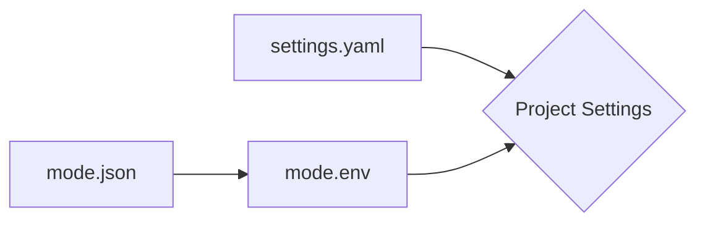

Core **Settings** are in **`YAML`** format. Because **YAML** is easy to read.

> "is a human-readable data-serialization language". — **Wikipedia**

**Environment Variables** are in **`dot.env`** because are dependent in the current environment **mode**.

---

## Settings **Workflow**

1. Load **`settings.yaml`**
2. Load **`mode.json`**
3. Load **`Environment Variables`**



---

## Locations

```text
root/                           --> <Directory> - Project's Root.
|
|--  config/                    --> <Directory> - Configurations.
|    |-- etc...
|    |-- env/                   --> <Directory> - Environments.
|    |   |-- development.env    --> <File> - Development Settings.
|    |   |-- production.env     --> <File> - Production Settings.
|    |   `-- staging.env        --> <File> - Staging Settings.
|    |
|    `-- mode.json              --> <File> - Current Mode.
|
|-- settings.yaml               --> <File> - Base Settings.
`-- etc...
```

=== "YAML (CODE)"

    ## **Settings** (YAML)

    ``` yaml
    # API Information
    VERSION: 0.1.0 # (1)
    APP_NAME: Fastberry # (2)
    ADMIN_EMAIL: fastberry@example.com # (3)

    # GraphQL (Output Folder) (4)
    GENERATES: graphql

    QUERYING:
      items_per_page: 50 # (6)
      max_depth: 4 # (7)

    # Allowed Hosts (5)
    ALLOWED_HOSTS:
      - http://localhost:8080
      - http://127.0.0.1:8080

    # Applications (8)
    INSTALLED_APPS:
      - my_awesome_app

    # Development (9)
    DEVELOPMENT_APPS:
      - some_development_tool

    # Middleware (10)
    MIDDLEWARE:
      - myapp.middleware.SomeMiddleware

    # Extensions (11)
    EXTENSIONS:
      - myapp.extension.SomeExtension

    # Permissions (12)
    PERMISSIONS:
      - myapp.permission.SomePermission

    # Event-Startup (13)
    ON_STARTUP:
      - myapp.events.OnStartup

    # Event-Shutdown (14)
    ON_SHUTDOWN:
      - myapp.events.OnShutdown
    ```

    1. **API** — Current **Version**.
    2. **API** — Project **Name**.
    3. **API** — Admin **Email**.
    4. **Output** folder for **GraphQL Schema & Operations**.
    5. List of **Allowed Hosts** that can **connect** to the server.
    6. **Max** number of items to grab from the **Database**.
    7. **Max** number for the depth of **GraphQL Queries**.
    8. List of **Installed Apps** that are currently used in the project.
    9. List of **Development Apps** that are active when the server is running on **development mode**.
    10. List of **BaseMiddleware**(s) and uses **(Starlette)**
    11. List of **BaseExtension**(s) and uses **(Strawberry)**
    12. List of **BasePermission**(s) and uses **(Strawberry)**
    13. **FastAPI** **`Startup`** event. Everything You want to **load** before the **`SERVER`** starts.
    14. **FastAPI** **`Shutdown`** event. Everything You want to **stop** before the **`SERVER`** shutdown.

=== "Middleware, Extension and Permissions"

    ## **Breakdown** of the **Settings**

    ---

    #### MIDDLEWARE [(Starlette)](https://www.starlette.io/middleware/)

    > List of active **Middlewares**.

    You can create your own **middleware** by using the **base module**.

    The **BaseMiddleware** included is just a wrapper/rename for **BaseHTTPMiddleware** from **Starlette**

    ---

    #### EXTENSIONS [(Strawberry)](https://strawberry.rocks/docs/guides/custom-extensions)

    > List of active **Extensions**.

    You can create your own **extension** by using the **base module**.

    The **BaseExtension** included is just a wrapper/rename for **Extension** from **Strawberry**

    ---

    #### PERMISSIONS [(Strawberry)](https://strawberry.rocks/docs/guides/permissions)

    > List of active **Permissions**.

    You can create your own **permissions** by using the **base module**.

    The **BasePermission** included is just a wrapper for **BasePermission** from **Strawberry**
